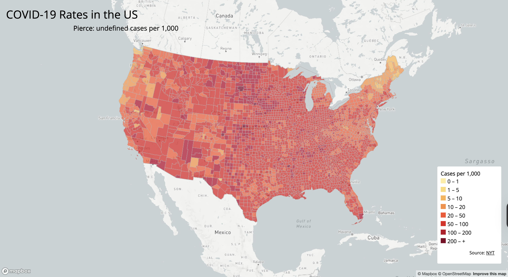
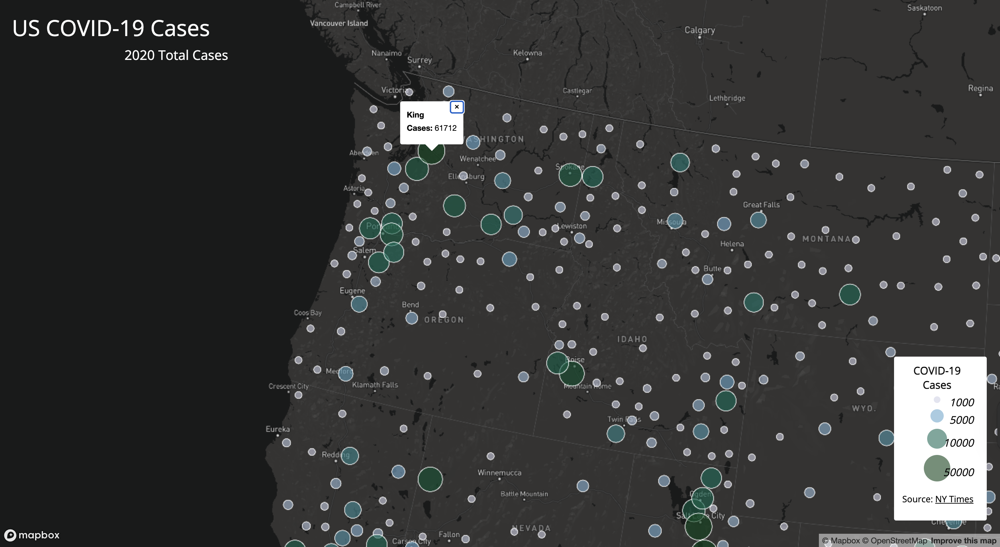

# Thematic web maps of COVID-19 in the United States (2020)

## Project Introduction
This project provides 2 interactive web maps that are thematic to visualize 2020 COVID-19 data of the United States. This is done in a county level to be applied ina choropleth and proportional symbol map. The maps split the data into 2, highlighting case rates and total case counts.

## Maps (links)
**Choropleth Map: COVID-19 Case Rates** 
  https://Maikhanhvt.github.io/US-thematic-maps-of-COVID-19/map1.html
  

**Proportional Symbols Map: COVID-19 Case Counts**  
  https://Maikhanhvt.github.io/US-thematic-maps-of-COVID-19/map2.html 
  

## Data Sources
- **COVID-19 Case and Death Data (2020): The New York Times
- **Population Data: 2018 ACS 5-Year Estimates
- **Geographic Units: U.S. counties (U.S. Census Bureau)
(Case rates are calculated as cases per 1,000 residents.)

---

## Primary Functionalities

**COVID-19 Case Rates (Choropleth)**
- Interactive map, visualizing COVID-19 case rates
- Colored and scaled legend
- Uses Mapbox GL expression functions `step` and `get` to classify numeric data
- hover over states displays county name and case rate at the top (interactive)
- Sequential color gradient represents the county polygons 

**COVID-19 Case Counts (Proportional Symbols)**
- Interactive map, visualizing total COVID-19 case counts
- Colored and scaled legend
- Sizes of the circles are proportional with case amounts
- Color scheme relates to values
- Clickable symbols to display county name and total cases (interactive)

* Projection: Albers Equal Area projection for US maps

---

## Libraries & Resources Used
- Mapbox GL JS
- Google Fonts 
- Mapshaper

## Credits & Acknowledgments
- The New York Times - COVID-19 data
- U.S. Census Bureau (ACS 2018) - Population data
- U.S. Census Bureau - County boundaries